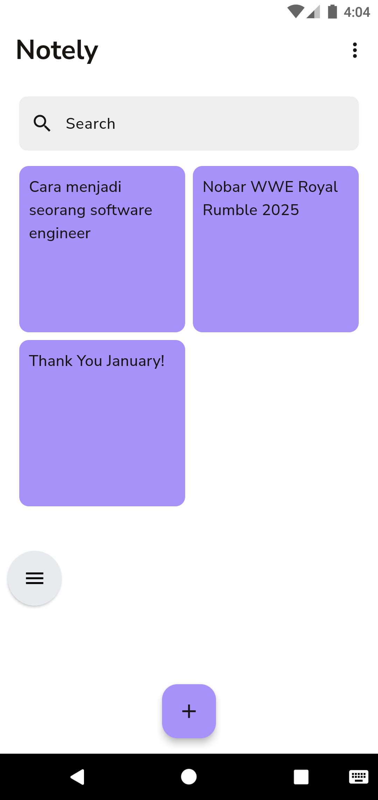

# Notely

Notely is a simple and efficient note-taking application built using Flutter. This app allows users to create, edit, and delete notes with a clean and intuitive interface. The application is powered by Hive for local storage and Riverpod for state management.

## Features ✨

### Core Features:

📝 Create Notes: Easily add new notes to store important information.

✏️ Edit Notes: Modify existing notes effortlessly.

🗑️ Delete Notes: Remove unwanted notes with a simple action.

### Optional Features:

🌍 Multi-language Support: Available in both English and Indonesian.

🌗 Light & Dark Mode: Choose between light mode and dark mode for better readability.

## Screenshots 📸

Here are some previews of Notely in action:

- Light Mode

- Dark Mode

## Tech Stack 🛠️

- Flutter (for UI development)
- Hive (for local database storage)
- Riverpod (for state management)
- GoRouter (for navigation management)

Design Inspiration 🎨
This app's design is inspired by David Consul. You can check out the original design [here](https://www.figma.com/community/file/1166192037435566473)

Feel free to contribute, report issues, or give suggestions! 😊
